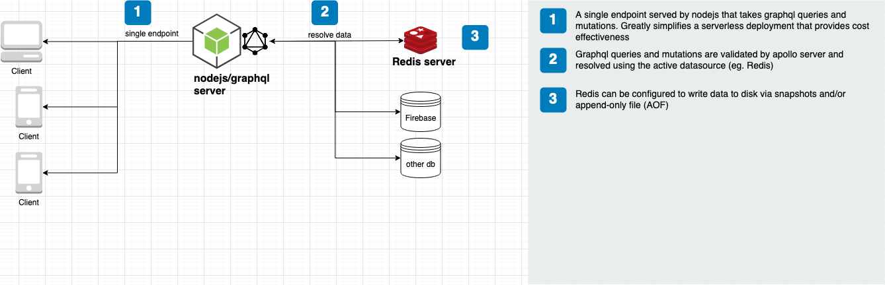

# SimpleUserCMS

- This server provides endpoints for interacting with a Redis db.
- It assumes:
	- you have a Redis server up and running (local or hosted)

## Environment variables
var             | default   | valid values
--------------- | -------   | ------------
DEBUG           |  -        | sim
NODE_ENV        |  -        | production (disables graphql playground and introspection)
SIM_GQL_PATH    |  -        | /api/graphql (path for serving requests)
SIM_DATASOURCE  |  -        | redis
SIM_REDIS_HOST  | localhost | 
SIM_REDIS_PORT  | 6379      | 
SIM_REDIS_AUTH  |  -        | somekey

## Testing
- To run unit and integration tests together: `npm test`
- There are Postman example calls:
	- _GraphQL_ serverless: https://documenter.getpostman.com/view/1592722/SzezcXcj?version=latest
	- _REST_ server (deprecated):  https://documenter.getpostman.com/view/1592722/SzRyzqB6?version=latest

## Graphql
* Graphql Playground is available at http://localhost:3000/graphql
* `npm run dev`

## Redis
* Monitor commands issued to Redis during dev/debugging `npm run start-rediscli` > `MONITOR`

## VS Code config
* [vscode config examples](vscode-configs.md)